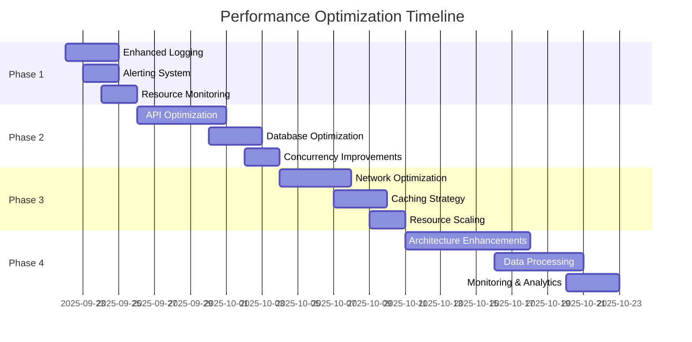

# LCW Data Fetcher Performance Optimization Plan

## Executive Summary

Based on the analysis of 4,235 fetch cycles over the past 72 hours, the system shows good overall performance with 76.3% of cycles completing within 20 seconds. However, 1.8% of cycles (78 instances) are taking over 60 seconds, with the worst case reaching 172.2 seconds. This document outlines a systematic approach to optimize performance and address outlier issues.

## Current Performance Metrics

| Metric | Value |
|--------|-------|
| Total Cycles Analyzed | 4,235 |
| Average Completion Time | 19.88s |
| Median Completion Time | 16.84s |
| Fastest Cycle | 14.02s |
| Slowest Cycle | 172.20s |
| 95th Percentile | 34.2s |
| 99th Percentile | 78.67s |

### Performance Categories
- **Fast (≤20s)**: 76.3% - ✅ Optimal performance
- **Normal (20-30s)**: 16.6% - ✅ Acceptable
- **Slow (30-60s)**: 5.2% - ⚠️ Needs attention
- **Very Slow (>60s)**: 1.8% - ❌ Critical issue

## Phase 1: Immediate Monitoring & Alerting (Week 1)

### 1.1 Enhanced Logging Implementation
- [ ] **Add granular timing logs** for each fetch operation:
  - API status check timing
  - Individual API call durations (coins, exchanges, markets)
  - Database write operation timing
  - Network request/response times

```python
# Example implementation
import time
import logging

class PerformanceLogger:
    def __init__(self, operation_name):
        self.operation_name = operation_name
        self.start_time = None
    
    def __enter__(self):
        self.start_time = time.time()
        return self
    
    def __exit__(self, exc_type, exc_val, exc_tb):
        duration = time.time() - self.start_time
        logging.info(f"{self.operation_name} completed in {duration:.2f}s")
        
        # Alert on slow operations
        if duration > 30:
            logging.warning(f"SLOW OPERATION: {self.operation_name} took {duration:.2f}s")
```

### 1.2 Performance Alerting System
- [ ] **Set up alerts** for cycles exceeding thresholds:
  - Warning: >30 seconds
  - Critical: >60 seconds
- [ ] **Create dashboard** with real-time performance metrics
- [ ] **Implement email/Slack notifications** for critical issues

### 1.3 Resource Monitoring
- [ ] **Monitor system resources** during fetch cycles:
  - CPU usage
  - Memory consumption
  - Network I/O
  - Database connection pool status

## Phase 2: Code Optimization (Week 2-3)

### 2.1 API Call Optimization
- [ ] **Implement request timeouts**:
```python
# Current: No timeout
response = requests.get(url)

# Improved: With timeout
response = requests.get(url, timeout=(5, 30))  # 5s connect, 30s read
```

- [ ] **Add retry logic with exponential backoff**:
```python
from tenacity import retry, stop_after_attempt, wait_exponential

@retry(
    stop=stop_after_attempt(3),
    wait=wait_exponential(multiplier=1, min=4, max=10)
)
def fetch_with_retry(url):
    return requests.get(url, timeout=(5, 30))
```

- [ ] **Implement circuit breaker pattern** for API failures
- [ ] **Add request pooling** to reuse HTTP connections

### 2.2 Database Optimization
- [ ] **Analyze database queries** for bottlenecks
- [ ] **Implement connection pooling** if not already present
- [ ] **Add database query timing logs**
- [ ] **Consider batch inserts** for multiple records

### 2.3 Concurrent Processing Improvements
- [ ] **Review current concurrency limits**
- [ ] **Implement adaptive timeouts** based on historical performance
- [ ] **Add queue monitoring** for pending jobs

## Phase 3: Infrastructure Optimization (Week 3-4)

### 3.1 Network Optimization
- [ ] **Test different API endpoints** if available
- [ ] **Implement DNS caching**
- [ ] **Consider CDN usage** for static resources
- [ ] **Monitor network latency** to external APIs

### 3.2 Caching Strategy
- [ ] **Implement API response caching** for frequently accessed data:
```python
from functools import lru_cache
from datetime import datetime, timedelta

@lru_cache(maxsize=128)
def get_api_status_cached():
    # Cache API status for 5 minutes
    return fetch_api_status()
```

- [ ] **Cache database queries** where appropriate
- [ ] **Implement Redis/Memcached** for distributed caching

### 3.3 Resource Scaling
- [ ] **Evaluate Docker resource limits**
- [ ] **Consider horizontal scaling** for high-load periods
- [ ] **Implement auto-scaling** based on queue depth

## Phase 4: Long-term Improvements (Week 4-6)

### 4.1 Architecture Enhancements
- [ ] **Implement async/await patterns** for I/O operations:
```python
import aiohttp
import asyncio

async def fetch_multiple_endpoints():
    async with aiohttp.ClientSession() as session:
        tasks = [
            fetch_coins(session),
            fetch_exchanges(session),
            fetch_markets(session)
        ]
        return await asyncio.gather(*tasks)
```

- [ ] **Consider microservices architecture** for different data types
- [ ] **Implement message queue** for decoupled processing

### 4.2 Data Processing Optimization
- [ ] **Implement incremental updates** instead of full fetches
- [ ] **Add data deduplication** logic
- [ ] **Optimize data transformation** processes

### 4.3 Monitoring & Analytics
- [ ] **Set up Prometheus/Grafana** for detailed metrics
- [ ] **Implement distributed tracing** with Jaeger/Zipkin
- [ ] **Create performance regression tests**

## Implementation Priority Matrix

| Task | Impact | Effort | Priority |
|------|--------|--------|----------|
| Add granular timing logs | High | Low | 🔥 Critical |
| Implement request timeouts | High | Low | 🔥 Critical |
| Set up performance alerts | Medium | Low | ⚡ High |
| Add retry logic | High | Medium | ⚡ High |
| Database query optimization | Medium | Medium | ⚡ High |
| Implement caching | Medium | Medium | 📋 Medium |
| Async/await patterns | High | High | 📋 Medium |
| Infrastructure scaling | Low | High | 📅 Low |

## Success Metrics

### Short-term Goals (4 weeks)
- [ ] Reduce 99th percentile from 78.67s to <45s
- [ ] Decrease very slow cycles (>60s) from 1.8% to <0.5%
- [ ] Improve average completion time from 19.88s to <18s

### Long-term Goals (8 weeks)
- [ ] Achieve 95% of cycles completing within 25s
- [ ] Eliminate cycles >60s entirely
- [ ] Reduce average completion time to <16s

## Risk Mitigation

### Potential Risks
1. **API rate limiting** during optimization testing
2. **Database performance degradation** during schema changes
3. **Service disruption** during infrastructure changes

### Mitigation Strategies
- Implement feature flags for easy rollback
- Use blue-green deployment for infrastructure changes
- Maintain comprehensive backup and recovery procedures
- Test all changes in staging environment first

## Timeline



## Next Steps

1. **Start with Phase 1** - Enhanced logging and monitoring
2. **Review and approve** this plan with the team
3. **Set up development environment** for testing optimizations
4. **Create feature branch** for performance improvements
5. **Begin implementation** following the priority matrix

---

**Document Status**: Draft v1.0  
**Created**: September 22, 2025  
**Next Review**: September 29, 2025  
**Owner**: Development Team